# IDS mini-project report

Disclaimer: unfortunately I needed to publish the project as a blog post as my company has started restricting PowerBi web publishing permissions.

Disclaimer2: The PowerBi report has been build to be an interactive report. Hence legends, titles, etc. are created automatically by PowerBi and have not been polished (as it makes no sense, since they will get messy everytime variable of interest is changed in the analyzer).

Disclaimer3: This project deliverable will be in actual use during the campaign. The campaing language is Finnish and hence there will be some references in the report in Finnish language. The Finnish language references refer to specific pages, graphs and alike in the .pbix file that will be submitted along this web-based report.

## Introduction

Finland will have parliamentary elections on the 2.4.2023. The typical problem of almost any candidate is, how to get return (votes) on invested campaign time and money. Moreover, all candidates must think about their campaign message and key themes so that they appeal to their target group and eventually lead to sufficient popularity.

Based on my experience, the above considerations are typically founded on heavy presumptions rather than data-backed observations. Campaign teams have a little if any knowledge of their potential voter based, the characteristics of different areas where they campaign, or how their competition is doing and which are the key differentiatiors between them and the opposition. This in my experience is true despite the fact that the data is publicly available.

I've built a data analyzer tool in PowerBi that allows the campaign team to observe past election performance in detail. Moreover, the tool combines the results with demographic data and therefore allows making observations and assumptions of potential target groups.

This blog post disassembles a PowerBi analyzer findings which study the election results from past elections, contrasts them with the demographic data and tries to gain insights on the geographic areas, target groups, opponents and other factors. The objective is to provide the candidate with information on how to allocate the scarce resources during the campaign (how to use marketing funds and on which platforms).

## Overall performance analysis

The first PowerBi report page (KUNTAVAALIT: Vantaa kokonaistulos) summarizes the municipal election results in 2021 in the city of Vantaa.

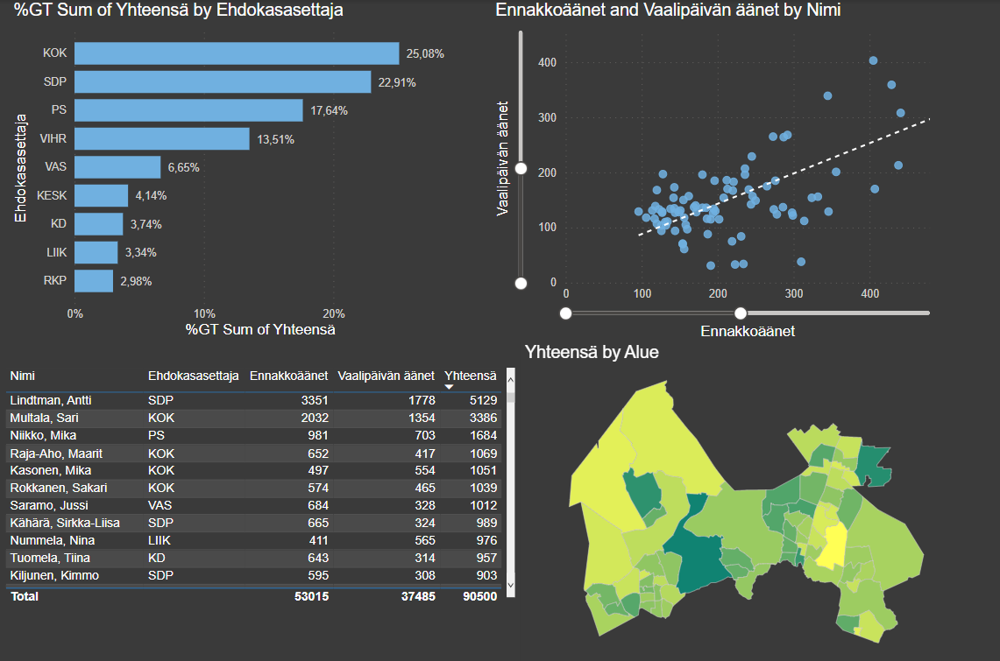

It summarize the performance of the parties (%GT Sum of Yhteensä by Ehdokasasettaja), performance of individual candidates, relationship between pre-poll and election day voting, and total votes per district (Yhteensä by Alue).

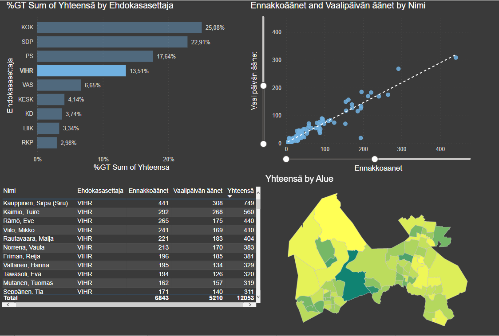

By filterin by the green party (Vihreät), we get to see for example their top performers and their popularity across districs (based on absolute vote count).

## Summary of the candidate's performance

The second PowerBi report page (KUNTAVAALIT: Eva kokonaistulos) illustrates the municipal election total vote count of the candidate split to pre-poll and election day votes, candidate's performance in different districts and relationship between pre-poll and election day vote count.

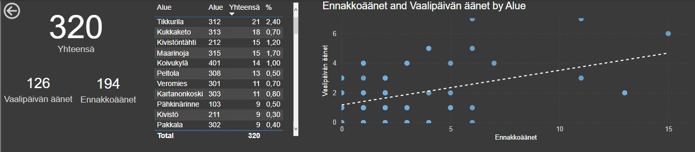

Filtering for example by the top 10 districts, we see that early campaining should be target to the areas that have generated most votes, as the pre-poll vote count is almost two times larger than the election day count in those districts (not shown here).

## Comparative analysis

The third PowerBi page (KUNTAVAALIT: Ehdokas vertailut) compares the candidate's performance in municipal election against other candidates around the city of Vantaa.

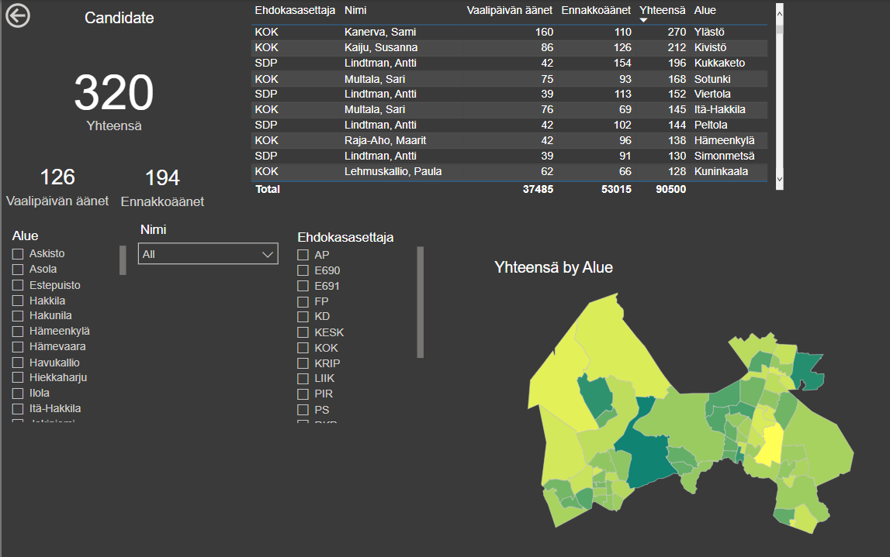

We may filter for example by area "Tikkurila" (top district for the candidate) and see who are the primary opponents and which parties have performed well in that area.

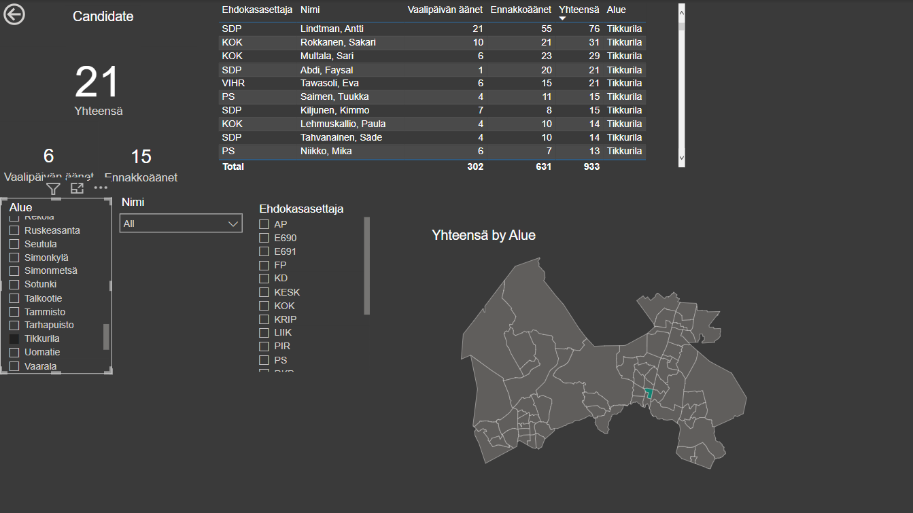

We also check the performance of a particular opponent or party member by filtering by candidate name (Nimi). For example, we could see there MP Sari Multala is performing well in the municipal elections:

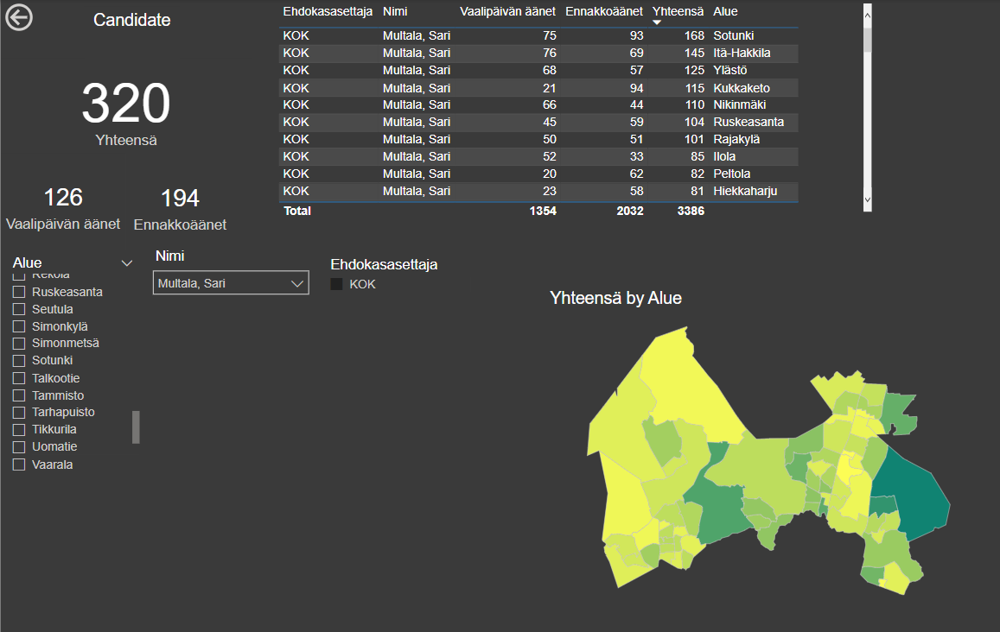

## Areas to target early

Pre-polling poses a challenge. Since around half of the voters will cast their votes already before the election day, the candidate must figure out how to prioritize the areas.

Moreover, it's a well-known fact that voters of different parties vote different time. Hence, it's good to study how much for example the candidate's party receives pre-poll votes. The below image displays the pre-poll and election day split (percentages of total) on the city map. It also shows how different parties receive pre-poll and election day votes.

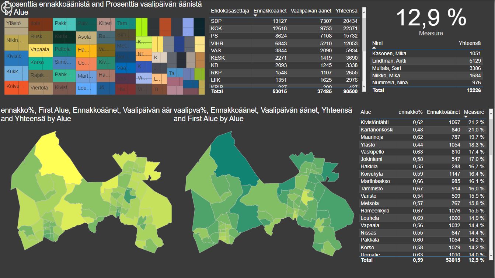

We can for example see that by sorting the bottom right table by column "Measure" (which is a PowerBi ad hoc 'Quick Measure') we find out in which areas has candidates party received the largest share of the pre-poll votes (Kivistöntähti, Kartanonkoski, Maarinoja...).

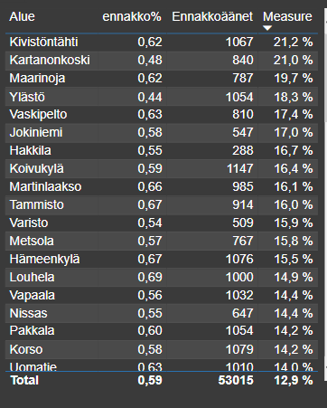

## Different election data

Above, we gained some insight to election performance with municipal election data. The candidate has also been running in the county elections in 2022.

Since the county she was running from was Vantaa-Kerava, we can actually have very nice comparative analysis against the municipal elections.

For instance, we can analyze how her party received pre-poll day votes. The results are suprisingly similar. In total the party received again around 12 % of the total votes and those came from very similar list of districts as in municipal elections.

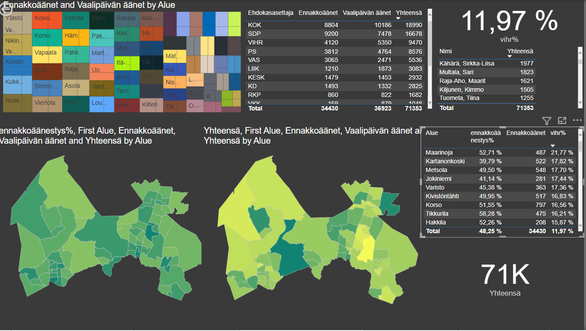

We may also compare the candidate's performance between the elections.

From the below image, we see that she was able to extend her popularity very much. In municipal elections she was able to reach +2% popularity in only one district. In the county elections she reached +2 % popularity in six districts. Obviously her vote count almost tripled between the elections (Kerava votes are missing from the total count).

We can also extend the exploration to who Uusimaa region (with Helsinki carved-out). The below image displays the high vote districs in the region.

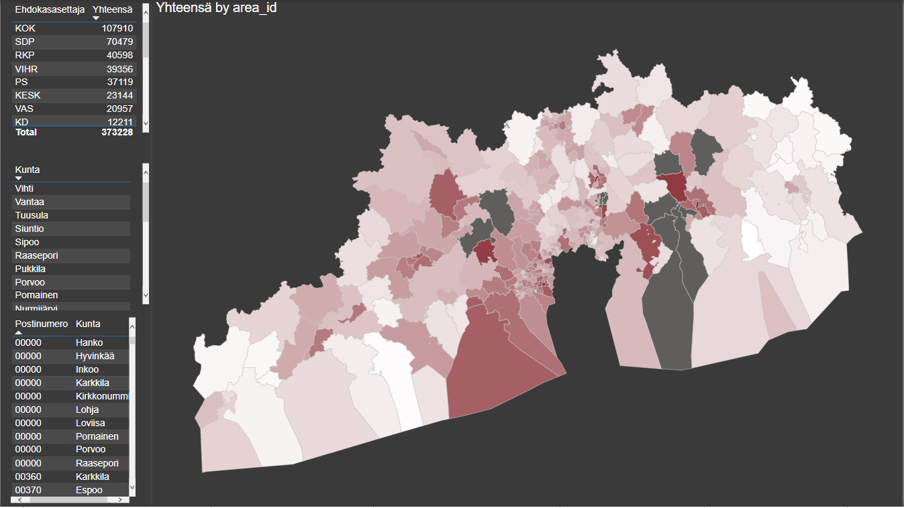

Filtering by the candidates party and for example Espoo (which is a very important city in the upcoming parlamentiary elections), we can very easily see, which areas could be the targets of interest for example for street advertising.

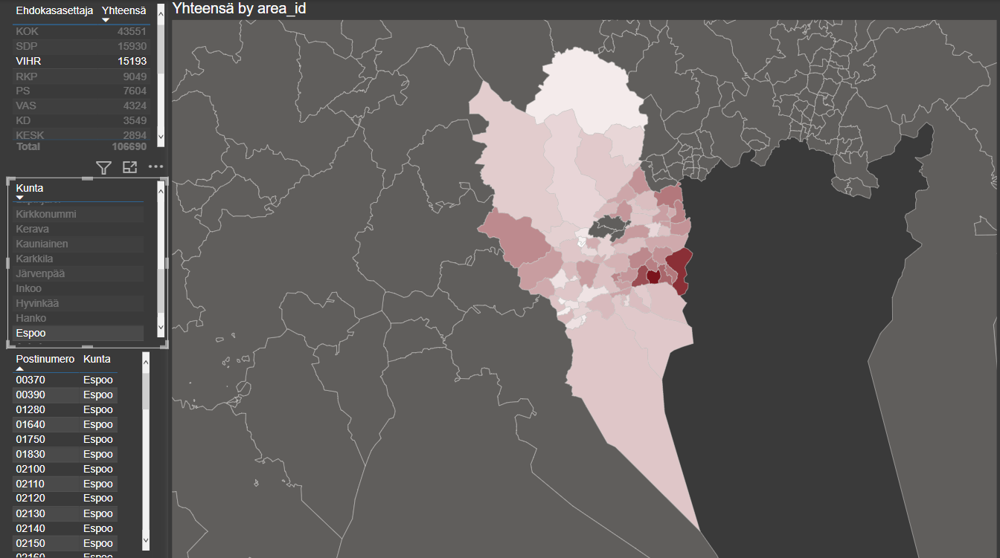

We can also see the appealing districts based on the demographic features. For example, if we select the top 5 postal codes with largest amount of people with master's degree, we see that they are also favorable postal codes for the candidate's party.

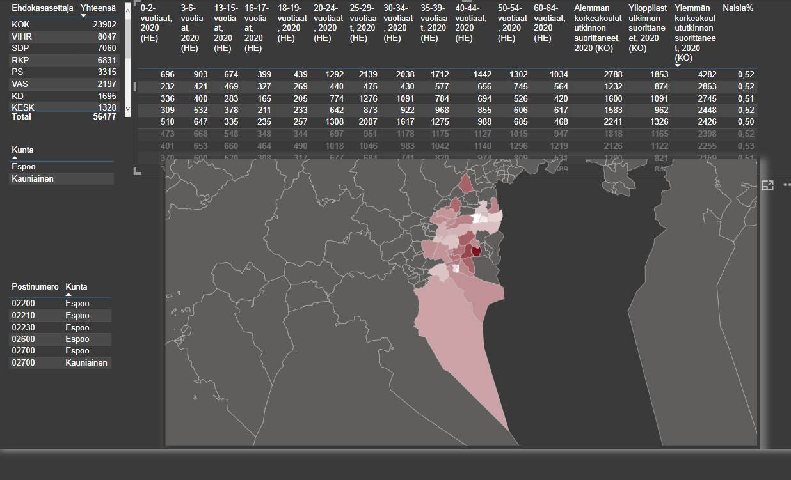

We can also analyse which parties are popular where young people live. For example filtering the top 5 with the highest share of 25-29 year olds reveals that again the candidate's party is favored (think about advertising strategy that is appealing to younger people) and shows the location of these areas.

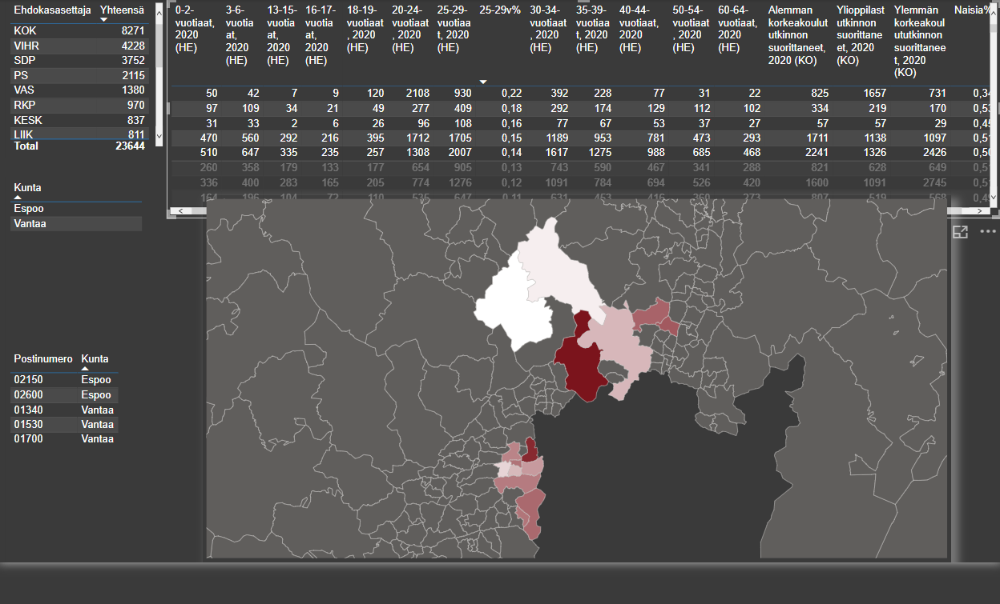

The candidate will probably run with theme's related to healthcare given her professional and educational background (and previous campaign themes). Hence, it's very interesting to see which areas are the key areas where people are occupied by healthcare industry (Q Terveys- ja sosiaalipalvelut). We see that a lot of people employed in the industry actually live very close to the big hospitals such as Jorvi and Peijas. These areas are also female dominant.

The party of the candidate is not doing so good in the areas where healthcare workers live (but performing close to the overall election performance of around 10% popularity).

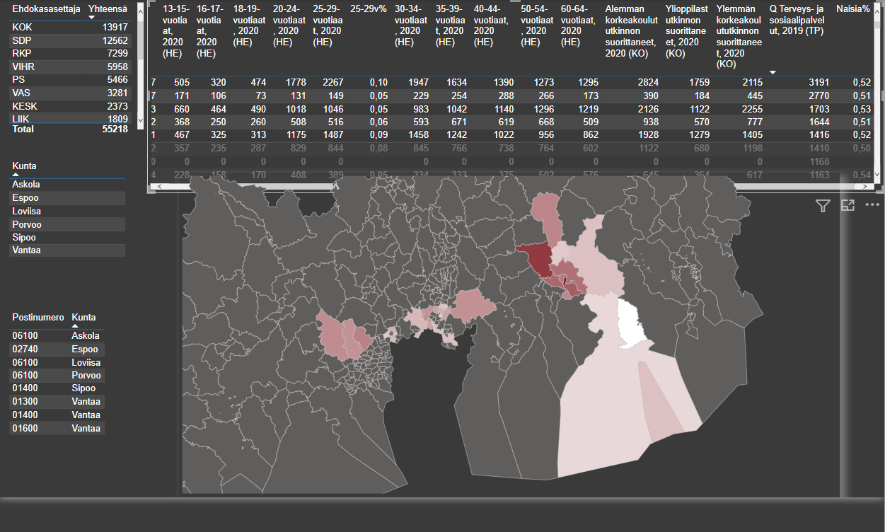

## Conclusion

This blog post represents just a small scratch on the surface of all the insights that could be gained by visualizing, slicing & dicing and combining historical election data and demographic data.

With the findings discussed above the candidate is already able to:
* Identify her best districs in Vantaa and in Uusimaa (not shown but can be done with 2019 data)
* Identify how her party and key opponents are doing
* Identify how to time the campaing in different locations
* Identify demographic correlations with her party and different demographic segments
* Identify and validate campaign themes that could potentially reach her sweetspot target group
* Identify how to market (to target groups) and which medias to use for marketing

This analysis validated many of the presumptions I had prior to running the analysis. Much could be gained by analysing also the negative scenarios such as:
* In which demographic segments the party of the candidate does not obtain success
* Which districs are least favorable and why
* Where she has lost popularity

I would also be very interesting to import campaign execution data and see the effectiveness of the campaigning. The campaign team has for example SportsTracker records of the flyer delivery (in which districts has the team has spent time on marketing) which could be correlated with the election results.

